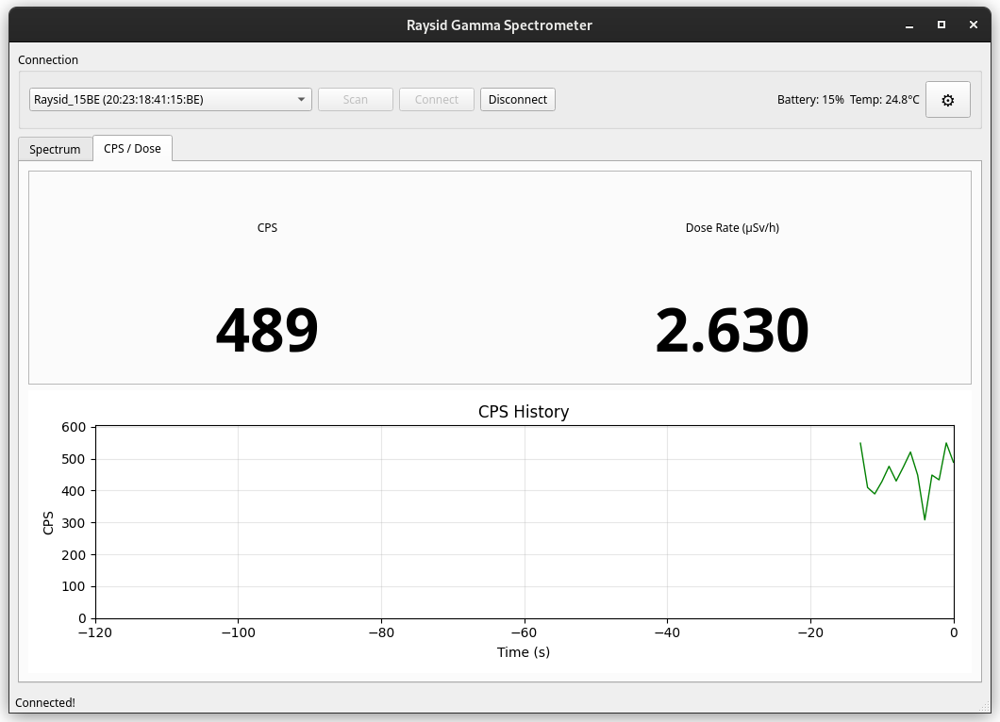
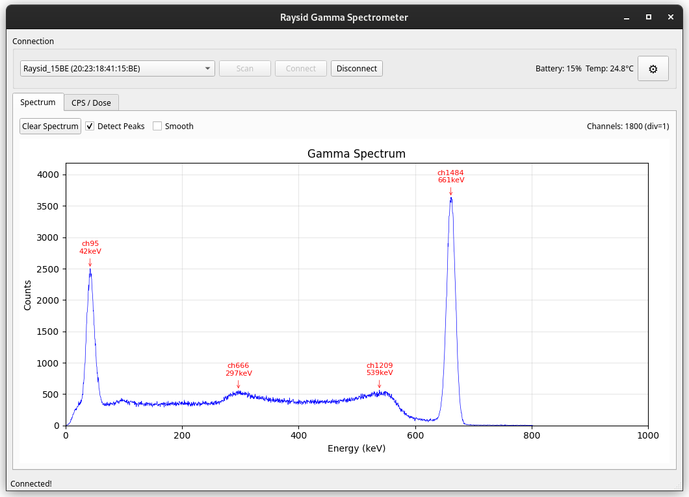

# Raysid App

Desktop app for Raysid gamma spectrometer. BLE connection, spectrum plot, CPS/dose readout.





## Install

```bash
curl -fsSL https://raw.githubusercontent.com/p01t3rge1st/raysid-app/master/install.sh | bash
```

Works on Linux and macOS. Requires Python 3.10+.

## Run

```bash
raysid-app
```

## Known Issues

**Bluetooth can be unstable.** Connection drops happen. If device won't connect, toggle Bluetooth off/on and retry.

**Random crashes occur.** The app may crash unexpectedly during spectrum updates or BLE operations. Just restart it.

**Linux BLE permissions.** You may need to run with sudo or add user to `bluetooth` group.

## Manual Install

If the script fails:

```bash
pipx install git+https://github.com/p01t3rge1st/raysid-app.git
```

Or with pip:

```bash
pip install --user git+https://github.com/p01t3rge1st/raysid-app.git
```

## Uninstall

```bash
pipx uninstall raysid-app
```

## License

MIT
